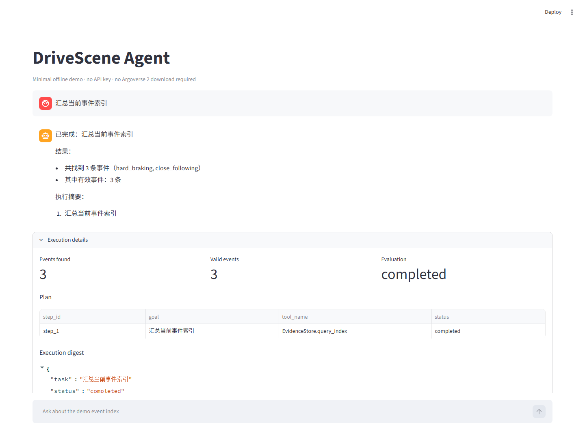
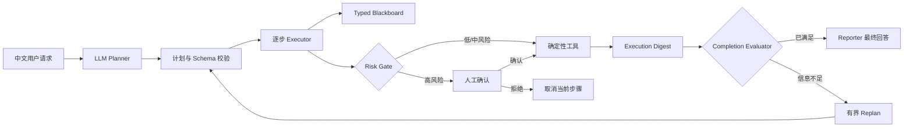

# DriveScene Agent

面向自动驾驶轨迹数据的 **Plan-and-Execute AI Agent**：用大模型理解中文任务并编排工具，用确定性 Python 模块完成事件检索、轨迹分析、证据导出和高风险操作控制。

> 在 120 条 heldout / adversarial / safety 主评测上取得 **86.7%（104/120）严格 whole-case 通过率**；富契约提示包较 schema-only 消融提升 **65.0 个百分点**。

| 分层评测集 | 主评测严格通过率 | 自动化测试 |
| ---: | ---: | ---: |
| 200 条中文任务 | 86.7%（104/120） | 252 个 |



## 项目解决什么问题

自动驾驶数据分析往往不是一次函数调用：用户可能先要求查找急刹事件，再获取动画与轨迹证据，最后导出文件；如果中间结果不足，还需要重新规划。直接让 LLM 读原始轨迹、猜测计算结果或自由操作文件，既不可靠，也难以审计。

DriveScene Agent 将职责拆开：

- **LLM 负责理解与规划**：把中文需求转换为带依赖关系的结构化步骤。
- **确定性工具负责执行**：轨迹指标、事件检测、索引查询、文件与表格操作均由 Python 完成。
- **运行时负责可靠性**：校验计划、绑定状态、检查任务完成度，并拦截删除、覆盖和原地修改。

这使 Agent 的每一步都能回答三个问题：为什么调用这个工具、参数来自哪里、执行前是否需要人工确认。

## 系统架构



正式入口采用 Plan-and-Execute，而不是无限循环的 ReAct。规划、执行、完成度判断和用户汇报被明确分层，每次任务最多进行一次有界重规划。

## 五个面试级设计点

### 1. Plan-and-Execute：先形成可审计计划，再执行工具

Planner 输出 `step_id`、`goal`、`tool_name`、`args`、`depends_on` 和 `status`。运行时拒绝未知工具、重复步骤、前向依赖、非 pending 状态和超长计划；JSON 不合法时只允许一次有界纠正。

### 2. Rich Tool Contract：不只提供函数名和参数表

每个工具同时声明输入输出契约、适用场景、禁用场景、中文说明和示例。Full 配置与 schema-only 使用同一模型和同一批任务，严格通过率分别为 **86.7%** 和 **21.7%**。这一结果说明的是整个富契约提示包的贡献，不把增益归因于某一个字段。

### 3. Typed Blackboard：让跨步骤数据传递脱离脆弱字符串

工具结果被整理为 `events`、`review_ids`、`evidence_paths`、`export_dirs`、`top_event` 等语义槽位。后续步骤通过结构化状态引用取值，Executor 在真正调用工具前完成引用解析、参数绑定和类型校验。

### 4. Completion Evaluator：工具成功不等于任务完成

系统从执行摘要中检查用户要求的事件数量、事件类型、证据文件、导出结果或删除结果。如果“文件夹创建成功，但证据没有复制”，任务会进入 `needs_replan`，而不是被错误报告为完成。

### 5. Risk Gate：危险操作必须经过人工确认

删除、覆盖复制以及表格原地修改会被识别为高风险操作。Executor 暂停执行并返回待确认状态；只有用户确认后才会调用工具，拒绝则记录取消结果。

更完整的设计见 [架构说明](docs/architecture.md) 和 [中文工具契约](docs/tools_zh.md)。

## 三分钟离线体验

离线 Demo 使用真实 Plan-and-Execute 运行时和三条内置事件索引，不需要 API Key，也不需要下载完整 Argoverse 2 数据。

```bash
git clone https://github.com/domino-xue/drivescene-agent.git
cd drivescene-agent
python -m venv .venv
```

Windows PowerShell：

```powershell
.\.venv\Scripts\Activate.ps1
python -m pip install -e ".[dev]"
python scripts/run_demo.py --question "找 2 个有效急刹案例"
python -m streamlit run scripts/demo_app.py
```

macOS / Linux：

```bash
source .venv/bin/activate
python -m pip install -e ".[dev]"
python scripts/run_demo.py --question "找 2 个有效急刹案例"
python -m streamlit run scripts/demo_app.py
```

CLI 会输出计划步骤、确定性工具结果、完成度判断和最终回答；Streamlit 页面展示相同执行链路。更多示例见 [离线 Demo 指南](demo/README.md)。

## 评测结果

项目包含 200 条程序生成的中文 Planner 任务，并按用途严格分层：40 条 development、40 条 regression、60 条 heldout、40 条 adversarial、20 条 safety。首页指标只统计后 120 条主评测。

| 配置 | Whole-case pass | Wilson 95% CI | 相对 Full |
| --- | ---: | ---: | ---: |
| Full rich contract | **104/120（86.7%）** | 79.4%–91.6% | — |
| No retry | 102/120（85.0%） | 77.5%–90.3% | -1.7 pp |
| Schema only | 26/120（21.7%） | 15.2%–29.9% | -65.0 pp |
| Names only | 0/120（0%） | 0%–3.1% | -86.7 pp |

Whole-case 只有在步数、工具选择、依赖、参数和确认行为全部正确时才通过。该指标是有限契约评测结果，不是开放域“模型准确率”。16 条严格失败的审计发现：4 条较明确属于模型错误，12 条涉及题面缺少字段或默认值等价判分；这些争议项需要修订数据集后重新评测，不能事后直接改写正式分数。

完整方法、启发式下界和失败分析见 [评测说明](docs/agent_evaluation.md)，紧凑结果见 [评测摘要](evals/planner_ablation_deepseek_v4_flash_summary.json)。

## 为什么不是普通的“LLM 套壳”

- LLM 不直接产生轨迹结论，而是选择和编排受控工具。
- 运动学计算、事件检测、索引检索和证据渲染均可独立测试。
- Tool Registry 是唯一可执行边界，Planner 不能凭空发明函数。
- 跨步骤状态、完成度判断和风险确认由运行时负责，不依赖模型自觉。
- 评测保存模型、数据集哈希、代码版本、逐例输出和置信区间，可复查而非只展示 Demo。

## 完整数据工作流

完整流程面向 Argoverse 2 Motion Forecasting 场景 parquet 与地图文件：

```text
原始场景 -> 轨迹特征 -> 事件检测 -> 复核队列 -> 可视化证据
        -> 人工标注 -> 统一事件索引 -> Agent 检索/分析/导出
```

复制示例配置后，根据本地数据目录调整路径：

```bash
cp config/data.example.yml config/data.yml
cp config/model.example.yml config/model.yml
```

Windows PowerShell 可使用：

```powershell
Copy-Item config/data.example.yml config/data.yml
Copy-Item config/model.example.yml config/model.yml
```

典型命令：

```bash
python scripts/summarize_dataset.py
python scripts/run_scene_labels.py --limit 500
python scripts/build_review_queue.py
python scripts/build_review_assets.py --limit 20 --force
python -m streamlit run scripts/review_app.py
python scripts/compute_review_metrics.py
python -m streamlit run scripts/agent_app.py
```

模型密钥只通过环境变量注入，不写入仓库：

```bash
export OPENAI_API_KEY="<your-api-key>"     # macOS / Linux
```

```powershell
$env:OPENAI_API_KEY = "<your-api-key>"    # Windows PowerShell
```

兼容 OpenAI API 的模型服务可通过 `config/model.yml` 配置；提交前请保留的只有 `*.example.yml`。

## 代码导览

| 想了解什么 | 推荐入口 |
| --- | --- |
| Planner、Executor、状态绑定和重规划 | [`src/drivescene/agent/plan_execute.py`](src/drivescene/agent/plan_execute.py) |
| Tool Contract 与统一注册表 | [`src/drivescene/agent/tool_registry.py`](src/drivescene/agent/tool_registry.py) |
| 风险分级与确认策略 | [`src/drivescene/ops/risk.py`](src/drivescene/ops/risk.py) |
| 完成度判断 | [`src/drivescene/agent/evaluator.py`](src/drivescene/agent/evaluator.py) |
| 200 条分层评测生成 | [`scripts/build_planner_eval_dataset.py`](scripts/build_planner_eval_dataset.py) |
| Planner 消融实验 | [`scripts/run_planner_ablation.py`](scripts/run_planner_ablation.py) |

## 面试材料

- [系统架构与技术取舍](docs/architecture.md)
- [评测方法、结果与失败审计](docs/agent_evaluation.md)
- [30 秒 / 2 分钟 / 5 分钟面试讲解](docs/interview_guide.md)
- [简历项目描述](docs/resume_project.md)
- [工具契约说明](docs/tools_zh.md)

## 技术栈

Python 3.11、LangGraph、LangChain、DeepSeek/OpenAI-compatible API、Pandas、PyArrow、Matplotlib、Streamlit、Pytest、Ruff。

## 项目边界

- 200 条 Planner 数据是程序生成的有限契约评测，不代表任意开放域问题。
- 当前模型结果来自一次 temperature=0 的运行；供应商输出仍可能存在非确定性。
- 原始 Argoverse 2 数据不随仓库分发；离线 Demo 用于验证 Agent 主链路，不代表完整数据规模。
- 当前启发式 Planner 是部分覆盖的离线调试下界，不是与 LLM Planner 等能力的竞争方案。
