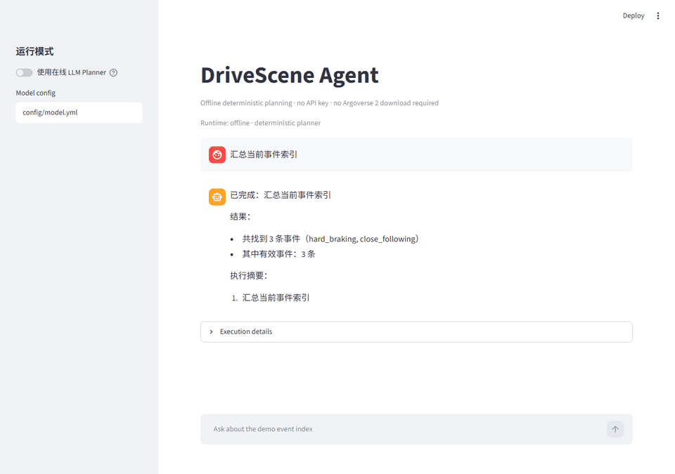
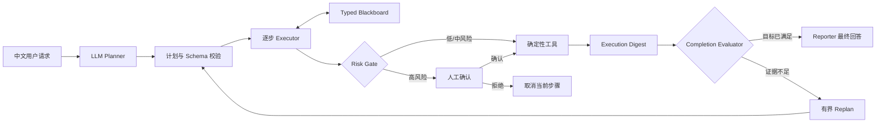

# DriveScene Agent

DriveScene Agent 是一个面向自动驾驶轨迹数据分析的 **Plan-and-Execute AI Agent**。它使用大模型理解中文任务并生成结构化计划，再由确定性 Python 工具完成事件检索、轨迹分析、证据生成和文件导出。

在 120 条 heldout、adversarial 与 safety 主评测上，系统取得 **86.7%（104/120）的严格 whole-case 通过率**；完整富契约提示包相较 schema-only 消融提升 **65.0 个百分点**。

| 分层评测任务 | 主评测 whole-case pass | 自动化测试 |
| ---: | ---: | ---: |
| 200 条 | 86.7%（104/120） | 254 个 |



> 动图由仓库中的实际 Demo Runtime 运行生成，展示结构化计划、工具结果与完成度判断。在线模式复用同一执行链路，并将 Planner 与 Reporter 切换为真实模型调用。

## 核心能力

- 使用自然语言组合事件检索、场景分析、可视化与证据导出任务。
- 将模型计划约束为带工具、参数和依赖关系的结构化步骤。
- 在步骤间传递事件、文件路径和统计结果等类型化状态。
- 检查用户目标是否真正完成，并在证据不足时进行一次有界重规划。
- 对删除、覆盖和原地修改等高风险操作要求人工确认。
- 提供无需模型密钥和完整数据集的离线演示。

## 快速开始：调用真实模型

推荐先使用 API Key 运行在线 Demo。它使用三条内置事件索引，因此不需要下载 Argoverse 2 数据；Planner 和 Reporter 会真实调用 `config/model.yml` 中配置的模型，其余计划校验、工具执行、状态绑定和完成度判断均使用正式 Runtime。

```bash
git clone https://github.com/domino-xue/drivescene-agent.git
cd drivescene-agent
python -m venv .venv
```

Windows PowerShell：

```powershell
.\.venv\Scripts\Activate.ps1
python -m pip install -e ".[dev]"
Copy-Item config/model.example.yml config/model.yml
$env:OPENAI_API_KEY = "<your-api-key>"
python scripts/run_demo.py --online --question "找 2 个有效急刹案例并给出动画路径"
python -m streamlit run scripts/demo_app.py
```

macOS / Linux：

```bash
source .venv/bin/activate
python -m pip install -e ".[dev]"
cp config/model.example.yml config/model.yml
export OPENAI_API_KEY="<your-api-key>"
python scripts/run_demo.py --online --question "找 2 个有效急刹案例并给出动画路径"
python -m streamlit run scripts/demo_app.py
```

示例配置默认使用 DeepSeek 的 OpenAI-compatible API。若使用其他兼容服务，只需修改 `model` 与 `base_url`；环境变量名继续使用 `OPENAI_API_KEY`。Streamlit 检测到密钥后默认启用在线 LLM Planner，也可以在侧栏切换运行模式。

CLI 会依次输出实际模型生成的计划、确定性工具结果、完成度判断和模型汇报。完整参数见[演示说明](demo/README.md)。

### 无 API Key 的离线回退

离线模式使用相同 Runtime 和内置事件索引，仅将 Planner 替换为确定性实现，适合检查安装、工具和 UI：

```bash
python scripts/run_demo.py --question "找 2 个有效急刹案例"
```

## 系统架构



系统将模型推理与数据计算分开：LLM 负责理解需求和选择工具；轨迹指标、事件检测、索引查询与文件操作由可测试的确定性模块执行；运行时负责计划校验、状态绑定、完成度判断和风险控制。

正式入口采用 Plan-and-Execute，而不是无限循环的 ReAct。一次任务先形成完整计划，再按依赖关系执行；如果完成度检查发现缺少必要证据，系统最多进行一次重规划。完整流程见[系统架构](docs/architecture.md)。

## 可靠性机制

### 结构化计划

Planner 输出包含 `step_id`、`goal`、`tool_name`、`args`、`depends_on` 和 `status` 的步骤。运行时拒绝未知工具、重复步骤、前向依赖、非法初始状态和超长计划；模型返回非法 JSON 时，只允许一次格式纠正。

### 富工具契约

工具注册表除参数 Schema 外，还声明输入输出语义、适用与禁用场景、中文说明和调用示例。这些信息帮助 Planner 区分名称相近但用途不同的工具。工具契约详见[工具说明](docs/tools_zh.md)。

### 类型化状态

Executor 将工具结果归一化为 `events`、`review_ids`、`evidence_paths`、`export_dirs` 和 `top_event` 等语义槽位。后续步骤通过结构化引用读取状态，并在工具调用前完成引用解析、参数绑定和类型校验。

### 完成度检查

工具成功不等于用户目标完成。Completion Evaluator 会从执行摘要中核对事件数量、事件类型、证据文件和导出结果。例如，创建导出目录但没有复制证据文件时，任务会被判定为 `needs_replan`，而不是直接返回成功。

### 风险控制

删除文件、覆盖复制和表格原地修改被识别为高风险操作。Executor 会暂停并返回待确认状态，只有收到明确确认后才执行；拒绝操作也会作为结构化结果进入任务状态。

## 评测

Planner 评测集包含 200 条程序生成的中文任务，按用途划分为 40 条 development、40 条 regression、60 条 heldout、40 条 adversarial 和 20 条 safety。正式主评测仅使用后三个未参与开发的分层，共 120 条任务。

| Planner 配置 | Whole-case pass | Wilson 95% CI | 相对完整配置 |
| --- | ---: | ---: | ---: |
| Full rich contract | **104/120（86.7%）** | 79.4%–91.6% | — |
| No retry | 102/120（85.0%） | 77.5%–90.3% | -1.7 pp |
| Schema only | 26/120（21.7%） | 15.2%–29.9% | -65.0 pp |
| Names only | 0/120（0%） | 0%–3.1% | -86.7 pp |

一条任务只有在步骤数量、工具选择、依赖关系、参数和确认行为全部满足预期时才计为 whole-case 通过。因此，86.7% 表示该有限工具契约下的严格任务通过率，不代表开放域模型准确率。

对 16 条严格失败的审计显示：4 条较明确属于模型错误；其余 12 条涉及题面缺少字段或默认值等价判分。这些样本仍按原始规则计为失败，待修订数据集后重新运行，不对既有结果做事后改分。

评测设计、分层结果、配对检验、启发式下界与失败样本见[评测报告](docs/agent_evaluation.md)。机器可读摘要位于 [`evals/planner_ablation_deepseek_v4_flash_summary.json`](evals/planner_ablation_deepseek_v4_flash_summary.json)。

## 完整数据工作流

完整流程面向 Argoverse 2 Motion Forecasting 场景 parquet 与地图文件：

```text
原始场景 -> 轨迹特征 -> 事件检测 -> 复核队列 -> 可视化证据
        -> 人工标注 -> 统一事件索引 -> Agent 检索/分析/导出
```

复制配置模板后，根据本地数据目录和模型服务调整配置：

```bash
cp config/data.example.yml config/data.yml
cp config/model.example.yml config/model.yml
```

Windows PowerShell：

```powershell
Copy-Item config/data.example.yml config/data.yml
Copy-Item config/model.example.yml config/model.yml
```

典型处理流程：

```bash
python scripts/summarize_dataset.py
python scripts/run_scene_labels.py --limit 500
python scripts/build_review_queue.py
python scripts/build_review_assets.py --limit 20 --force
python -m streamlit run scripts/review_app.py
python scripts/compute_review_metrics.py
python -m streamlit run scripts/agent_app.py
```

原始 Argoverse 2 数据不随仓库分发。数据目录结构、索引生成和人工复核流程见[数据与运行说明](docs/architecture.md#数据闭环)。

## 模型配置与密钥

模型服务通过 `config/model.yml` 配置，并支持 OpenAI-compatible API。密钥只通过环境变量注入，不应写入 YAML、源码或提交历史。

macOS / Linux：

```bash
export OPENAI_API_KEY="<your-api-key>"
```

Windows PowerShell：

```powershell
$env:OPENAI_API_KEY = "<your-api-key>"
```

仓库只应提交 `*.example.yml` 配置模板。运行密钥卫生测试：

```bash
python -m pytest tests/test_secret_hygiene.py -q
```

## 开发与测试

```bash
python -m pip install -e ".[dev]"
python -m ruff check .
python -m pytest -q
```

评测数据可以通过脚本重新生成并校验哈希：

```bash
python scripts/build_planner_eval_dataset.py
python scripts/run_planner_ablation.py
```

复现实验前请阅读[评测报告](docs/agent_evaluation.md#复现方式)，确认模型配置、数据集哈希和运行参数一致。

## 代码导航

| 模块 | 入口 |
| --- | --- |
| Planner、Executor、状态绑定与重规划 | [`src/drivescene/agent/plan_execute.py`](src/drivescene/agent/plan_execute.py) |
| Tool Contract 与统一注册表 | [`src/drivescene/agent/tool_registry.py`](src/drivescene/agent/tool_registry.py) |
| Completion Evaluator | [`src/drivescene/agent/evaluator.py`](src/drivescene/agent/evaluator.py) |
| 风险分级与确认策略 | [`src/drivescene/ops/risk.py`](src/drivescene/ops/risk.py) |
| 评测集生成 | [`scripts/build_planner_eval_dataset.py`](scripts/build_planner_eval_dataset.py) |
| Planner 消融实验 | [`scripts/run_planner_ablation.py`](scripts/run_planner_ablation.py) |

## 技术栈

Python 3.11、LangGraph、LangChain、DeepSeek / OpenAI-compatible API、Pandas、PyArrow、Matplotlib、Streamlit、Pytest、Ruff。

## 已知边界

- Planner 数据集是程序生成的有限契约评测，不能外推为任意开放域任务表现。
- 当前模型结果来自一次 `temperature=0` 的运行，供应商侧输出仍可能存在非确定性。
- 离线演示用于验证 Agent 主链路，不包含完整 Argoverse 2 数据规模。
- 启发式 Planner 仅覆盖部分任务，用作离线调试下界，不是与 LLM Planner 等能力的替代方案。
