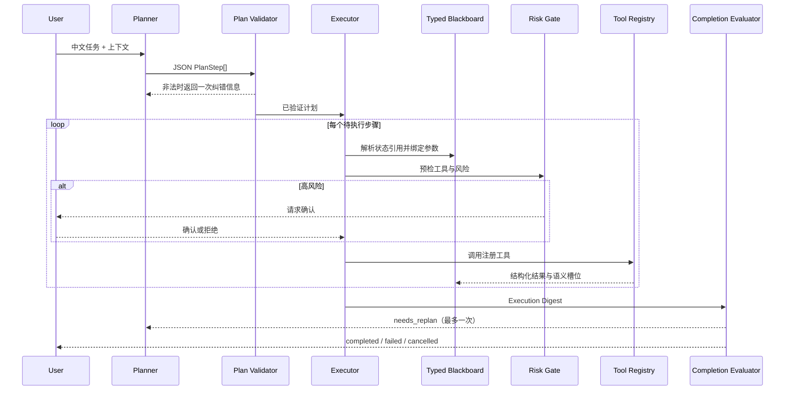

# DriveScene Agent 架构与技术取舍

本文从 AI Agent 工程视角解释 DriveScene Agent 的职责边界、执行链路和可靠性设计。快速体验见 [项目首页](../README.md)，工具参数见 [工具契约](tools_zh.md)。

## 一句话架构

DriveScene Agent 将 **非确定性的自然语言规划** 与 **确定性的领域计算和文件操作** 分离：LLM 只负责把意图转换成结构化计划，运行时负责校验、状态传递、风险控制和完成度判断，Python 工具负责真正执行。

## 为什么选择 Plan-and-Execute

ReAct 适合探索性任务，但在轨迹分析和文件操作场景中存在三个问题：工具调用过程不容易提前审计、长链路中参数引用容易漂移、高风险动作可能混在推理循环中被直接执行。

本项目采用 Plan-and-Execute：

1. Planner 一次生成结构化步骤和依赖。
2. Validator 在执行前检查完整计划。
3. Executor 按依赖顺序逐步运行。
4. Completion Evaluator 判断用户目标，而不是只检查工具是否返回成功。
5. 信息不足时只允许一次有界 Replan，避免无限循环和成本失控。

这个选择牺牲了一部分开放式探索能力，换取更强的可审计性、可测试性和风险边界。

## 主执行链路



## 结构化计划与校验

Planner 返回的每一步包含：

```python
PlanStep(
    step_id="step_1",
    goal="查找 5 个有效急刹事件",
    tool_name="EvidenceStore.query_index",
    args={...},
    depends_on=[],
    status="pending",
)
```

执行前校验覆盖：

- JSON 和字段结构是否合法；
- 工具是否存在于 `ToolRegistry`；
- `step_id` 是否为空或重复；
- 依赖是否只指向更早的步骤；
- 初始状态是否为 `pending`；
- 计划步数是否超过上限。

模型格式错误不会直接进入 Executor。系统将验证错误压缩后返回给 Planner，只允许一次纠正尝试。

## Tool Contract：把工具边界交给运行时

工具不是简单的函数名列表。每个 `ToolSpec` 包含：

- `args_schema`：参数名和类型；
- `input_contract` / `output_contract`：输入与输出语义；
- `when_to_use` / `do_not_use_when`：正反使用边界；
- `zh_note`：中文领域提示；
- `examples`：合法调用样例。

注册表是唯一执行入口。Planner 可以选择工具和参数，但不能调用未注册函数。Full 与 schema-only 的消融说明整个富契约提示包明显改善了严格 whole-case 表现；由于 Full 同时增加了多组信息，不能把 65.0pp 单独归因给某一个契约字段。

## Typed Blackboard：稳定的跨步骤状态

仅保存原始工具 JSON 会让后续步骤依赖脆弱选择器，例如把某个数组路径写错就无法继续。运行时因此维护 Typed Blackboard，把成功结果归一化为稳定语义槽位：

- `events` / `review_ids`；
- `evidence_assets` / `evidence_paths`；
- `export_dirs` / `copied_files`；
- `manifest_paths`；
- `top_event`。

Planner 可使用结构化引用：

```json
{"$from_state": "review_ids"}
```

或者在少数场景中选择前序步骤的结构化输出：

```json
{"$from_step": "step_1", "$select": "output.items[*].result.review_id"}
```

Executor 在调用工具前解析引用、补全可推导参数并再次执行参数验证。诊断信息与业务状态分开保存，避免错误文本被后续计划误当作数据。

## 工具结果：统一状态转换信封

不同工具统一返回：

```text
ok, operation, summary, items[]
```

每个 item 包含输入、成功状态、结果、错误和可选错误类型。这让批量任务可以保留“部分成功”，也让 Blackboard、执行摘要和 Completion Evaluator 使用同一种数据模型。

工具分为四类：

| 工具类 | 责任 |
| --- | --- |
| Retrieval | 查询统一事件索引和场景索引 |
| Analysis | 重新加载原始轨迹并计算运动学或检测事件 |
| Artifact | 建目录、复制证据、删除文件、写 manifest |
| Table | 筛选、删列、CSV/Parquet 格式转换 |

## Completion Evaluator：从“调用成功”升级为“目标完成”

Executor 将步骤结果汇总成 `ExecutionDigest`，Evaluator 再检查用户真正要求的交付物：

- 事件数量和事件类型是否满足；
- 是否返回证据路径；
- 是否实际生成或复制文件；
- 是否完成原始轨迹分析；
- 是否产生目标表格；
- 删除任务是否真的删除指定路径。

例如，创建导出目录虽然是成功工具调用，但如果用户要求的动画没有复制，状态仍然是 `needs_replan`。重规划请求只暴露已完成步骤、Typed Blackboard 和缺失要求，并限制为一次。

## Risk Gate：高风险动作的人机边界

风险判断由确定性策略完成，而不是让模型自行决定：

| 操作 | 风险 | 行为 |
| --- | --- | --- |
| 查询、分析、新建目录 | 低 | 直接执行 |
| 新建 manifest、派生表格 | 低/中 | 按策略执行 |
| 删除文件或目录 | 高 | 暂停并请求确认 |
| 覆盖复制、覆盖表格 | 高 | 暂停并请求确认 |
| input 与 output 相同的原地修改 | 高 | 暂停并请求确认 |

用户拒绝后，当前步骤被取消并记录原因，不会绕过确认自动重试。

## 数据闭环

Agent 上层依赖一条可复现的数据链：

```text
Argoverse 2 场景
  -> 运动学/相对运动/路径特征
  -> 五类规则事件候选
  -> 人工复核队列和可视化证据
  -> 带 review_id 的统一事件索引
  -> Agent 检索、复算、导出
```

LLM 不负责判断原始轨迹是否真的发生急刹或近距离跟车；这些结论来自确定性指标和人工复核。LLM 的价值集中在跨工具任务理解与编排。

## 关键技术取舍

| 决策 | 收益 | 代价 |
| --- | --- | --- |
| Plan-and-Execute 取代开放式 ReAct | 可审计、可控制、方便整体校验 | 探索性略弱 |
| Rich Tool Contract | 减少工具和参数误用 | Prompt 更长，需分组件评测 |
| Typed Blackboard | 跨步骤传值稳定 | 需要维护状态归一化规则 |
| 确定性 Completion Evaluator | 结果可测试、可解释 | 对开放式目标覆盖有限 |
| 有界重规划 | 控制成本和死循环 | 极复杂任务可能需要人工拆分 |
| 确定性 Risk Gate | 不依赖模型安全自觉 | 风险策略需随工具扩展 |

## 代码阅读顺序

1. [`src/drivescene/agent/tool_registry.py`](../src/drivescene/agent/tool_registry.py)：先看 Agent 能调用什么。
2. [`src/drivescene/agent/plan_execute.py`](../src/drivescene/agent/plan_execute.py)：再看规划、校验、执行、绑定和重规划。
3. [`src/drivescene/agent/evaluator.py`](../src/drivescene/agent/evaluator.py)：理解完成度判断。
4. [`src/drivescene/ops/risk.py`](../src/drivescene/ops/risk.py)：理解安全确认边界。
5. [`src/drivescene/eval/agent_eval.py`](../src/drivescene/eval/agent_eval.py)：最后看 whole-case 指标如何计算。

## 当前边界与下一步

- Planner 基准是程序生成的有限契约任务，不等于真实开放域流量。
- 当前富契约消融一次删除多个提示组件，下一步应继续拆分增量贡献。
- 评测题面存在源路径、列名缺失和默认值等价问题，需要修订数据集后完整重跑。
- 更强的竞争基线应使用同模型原生 tool calling / ReAct，并保持工具、预算和样本一致。

继续阅读：[评测说明](agent_evaluation.md) · [面试讲解](interview_guide.md) · [简历项目稿](resume_project.md)
