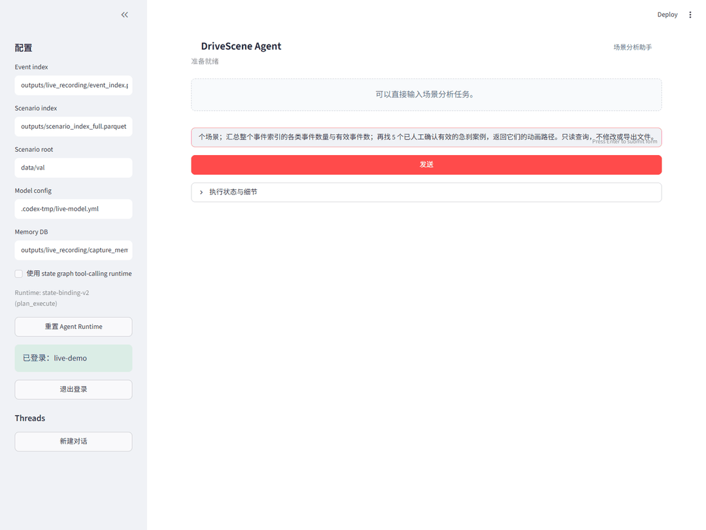
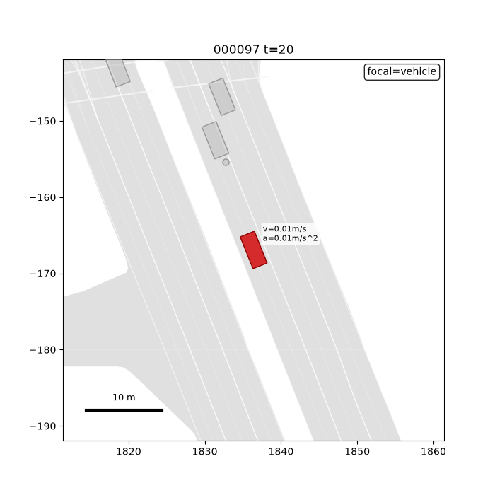

# 真实模型与 AV2 数据运行记录

2026-09-16，正式 `scripts/agent_app.py` 使用 DeepSeek `deepseek-flash` 完成一次在线会话。查询步骤成功，最终状态为 `needs_replan`；本页同时保留检索结果与失败信息。

## 数据范围

| 数据 | 本次实际范围 |
| --- | ---: |
| 本地 AV2 场景与全量场景索引 | 24,988 个，ID 无重复 |
| 轨迹记录行数 | 71,696,443 |
| 有地图的场景 | 24,988 |
| 事件索引 | 169 条，来自 123 个场景 |
| 人工确认有效 / 无效 / 未复核 | 113 / 11 / 45 |

城市分布：Miami 6,654；Pittsburgh 5,329；Austin 5,324；Washington DC 3,202；Dearborn 3,066；Palo Alto 1,413。事件类型分布：close_following 93、hard_braking 26、stopped_vehicle_ahead 25、lane_change 22、cut_in 3。

全量场景索引是读取本地每个场景 parquet 后生成的独立文件，未覆盖原有 500 场景索引。事件索引保留全部原有记录，仅为 WSL 运行将 Windows 路径分隔符转换为 `/`。没有把这 169 条事件宣称为全量场景检测结果。

## 请求与实际结果

本次只提交了一个用户问题：

> 请在全量场景索引中查询 Austin 有地图的前 3 个场景；汇总整个事件索引的各类事件数量与有效事件数；再找 5 个已人工确认有效的急刹案例，返回它们的动画路径。只读查询，不修改或导出文件。



初始计划包含 9 个查询步骤，均成功执行。其中全量场景索引返回：

- `00010486-9a07-48ae-b493-cf4545855937`
- `00190202-a988-4f35-96b5-876869b4e0a3`
- `001e7a56-f046-4f05-bd8f-ddf320079eae`

有效急刹检索返回 `000097`、`000098`、`000099`、`000100`、`000101`。五个动画文件均在本地实际存在。示例 `000097` 的清单与事件索引一致：场景 `02807b27-d648-4887-a79e-6f7b775eb34c`，轨迹 `133041`，事件时间步 `40–42`。



动画从原始复核资产直接复制，未修改帧或生成内容。SHA-256：`cb81a759499878dc41ef8e0f3fd441b2d89e84b50a683266f312ffdec677fb4b`。

## 本次暴露的问题

1. **否定指令误判**：Completion Evaluator 仅根据关键词检查“导出”，将“不修改或导出文件”判断成必须导出，触发一次额外重规划。
2. **不必要的文件操作**：重规划创建了空目录 `outputs/exports/valid_hard_braking_cases`；随后将 `export_dirs` 列表绑定到要求单一路径的 `output_dir`，复制失败。实际复制 0 个文件，删除 0 个文件。这也表明当前系统不能保证自然语言“只读”约束覆盖所有工具行为。
3. **摘要重复累计**：Digest 将 3 个场景命中、169 条分组统计、113 条有效子集和 5 条急刹命中相加成 290；Reporter 沿用了这个数。169 才是事件索引行数。不同查询范围的结果不能这样相加。

最终 `evaluation.status=needs_replan`，`completed=false`。这些属于本次真实数据会话发现的运行时问题，尚未在本记录中修复，不计为端到端成功；也不据此重算历史 Planner 指标。

对应代码：[完成度需求解析](../src/drivescene/agent/evaluator.py)、[执行摘要聚合](../src/drivescene/agent/digest.py)、[状态绑定](../src/drivescene/agent/plan_execute.py)。

## 模型调用与复核材料

- 一次用户会话包含 3 次真实模型响应：初始 Planner、补充 Planner、Reporter。
- 请求模型 `deepseek-flash`，`temperature=0`，`reasoning_effort=high`，采用 Chat Completions。
- 三次 API 响应耗时合计约 81.76 秒；总用量 35,975 tokens（包含推理 tokens），仅描述这一会话，不能视为平均延迟或成本基准。
- [机器可读记录](assets/real-data-run.json)保留原始计划、工具结果、完成度状态、未改写的模型回答、响应 ID、用量和数据索引哈希。
- GIF 由真实浏览器截图顺序编码，压缩等待时长；离线 Demo GIF 仍保留在 [Demo 指南](../demo/README.md)中，并非本次在线会话。

## 在本地真实数据上运行

安装项目依赖，将合法获取的 AV2 数据放入 `data/val`，先完成项目的数据处理与事件索引流程。随后构建覆盖全部本地场景的新索引：

```bash
python scripts/build_scenario_index.py --root data/val --output outputs/scenario_index_full.parquet --workers 8
```

该命令默认没有样本上限。只做安装检查时可以显式传入 `--limit 10`；失败的场景会令构建失败，不会被静默跳过。

本次模型配置如下（密钥只由 `OPENAI_API_KEY` 环境变量提供）：

```yaml
model:
  model: deepseek-flash
  base_url: https://api.deepseek.com
  temperature: 0
  reasoning_effort: high
  store: false
  use_responses_api: false
```

执行检索或启动正式 UI：

```bash
python scripts/run_agent_cli.py --event-index outputs/event_index.parquet --scenario-index outputs/scenario_index_full.parquet --scenario-root data/val --model-config config/model.yml --question "找 5 个已人工确认有效的急刹案例并给出动画路径"
python -m streamlit run scripts/agent_app.py
```

在 UI 侧栏中填写上述事件索引与全量场景索引路径，注册本地演示账号后开始提问。Linux / WSL 使用 Windows 上生成的旧索引时，应将副本中的路径转换成 `/` 并验证证据文件存在。

返回[项目首页](../README.md) · [历史 Planner 评测](agent_evaluation.md)
